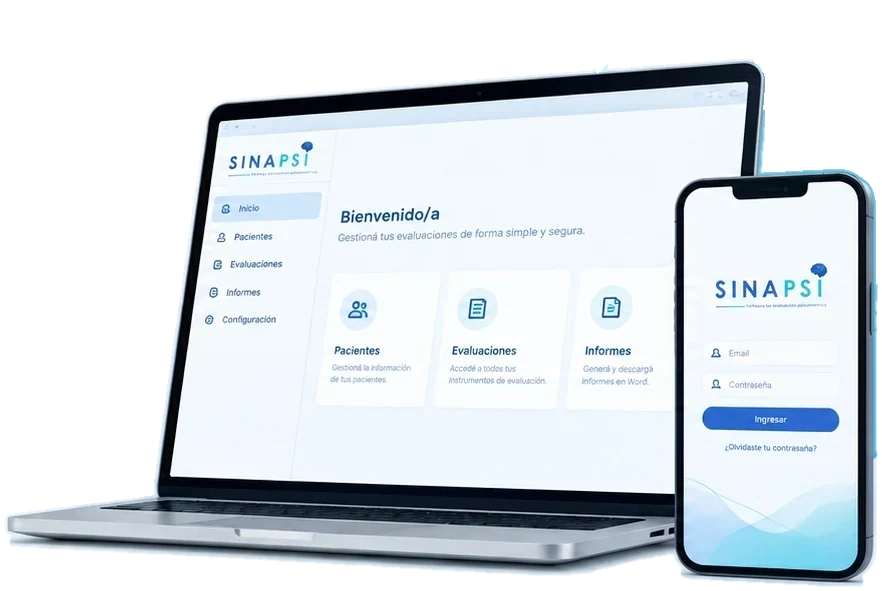
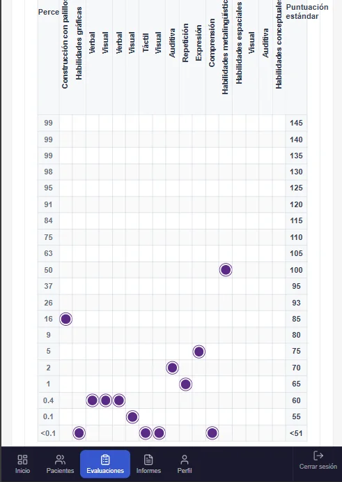
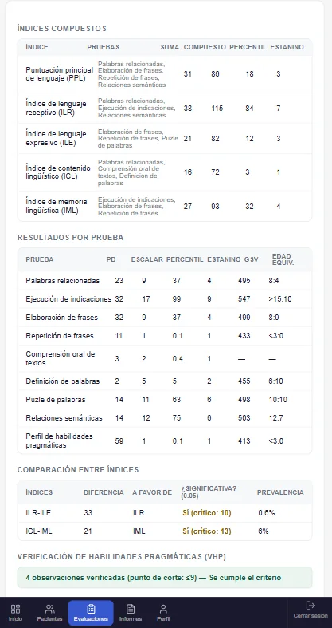
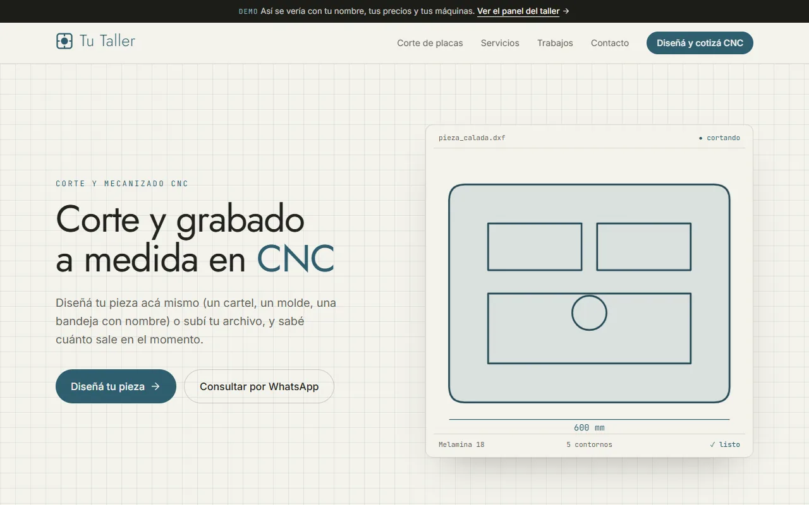
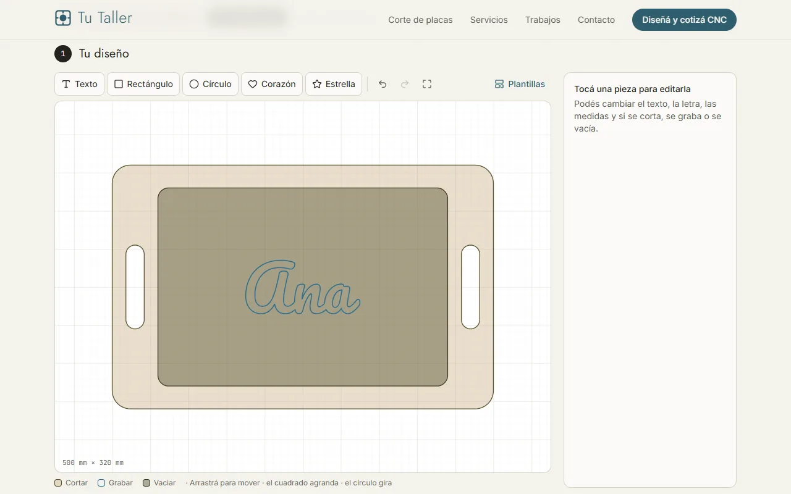

# Maxi Orias

Desarrollador full-stack en Trelew, Chubut. Vengo de la electrónica: de los circuitos al código.

Hoy me dedico a **[SinaPsi](https://sinapsisoftware.com)**, un software que hice para psicopedagogas y fonoaudiólogas. Cargan los puntajes de un test, el sistema calcula los resultados, arma los gráficos y les deja el informe en Word. Tiene 17 instrumentos y lo usan profesionales que pagan por usarlo. El código es privado porque maneja datos de pacientes.

  
  
  

### Otras cosas que hice

- **[Cotizador CNC](https://cotizador-cnc-demo.vercel.app)**: el cliente de un taller diseña su pieza o sube un DXF y ve cuánto sale. Calcula el tiempo de máquina y cómo entran las piezas en la placa.

  

    
    
  

- **Sitios para clientes**: una psicopedagoga, un emprendimiento de sublimación, una empresa de domótica, un estudio de arquitectura. Están todos en el portfolio.

### Con qué trabajo

También integro pagos con Mercado Pago.

### Dónde encontrarme

[Portfolio](https://maxi-portfolio-tawny.vercel.app) · [LinkedIn](https://www.linkedin.com/in/diegomaximilianoorias) · [SinaPsi](https://sinapsisoftware.com)
